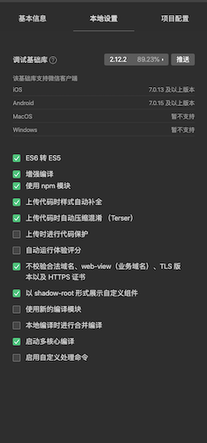

# wanandroid
## 玩安卓微信小程序

玩安卓微信小程序是基于 [玩安卓api](https://wanandroid.com/index) 开发的一款比较完整，UI质量比较高的项目，值得新手学习。

## 能从该项目中学到什么？

主要功能点
1. 自定义标题栏
2. tabs + swiper 联动
3. 双scroll-view 联动 
4. 自定义component及数据传递，事件传递 

## 项目截图
（如果显示不了图片，请使用科学上网）

## 项目功能

### 首页模块

1. banner 
2. 置顶文章
3. 首页文章列表

### 项目模块

滚动tab + swiper 懒加载 获取文章列表

### 问答

### 体系

实现 双scroll-view 联动 

### 导航

### 搜索

获取热点搜索 + 实现本地保存历史搜索记录

### 搜索结果

### 我的

排行榜

个人积分

我的分享列表 + 新增分享

我的收藏列表 + 添加收藏

### 项目配置

### 厚脸皮贴图

